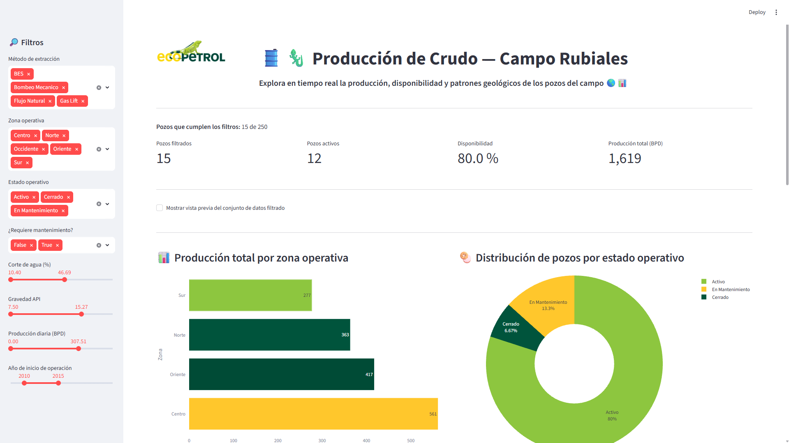

<p align="center">
  
</p>

<h1 align="center">🛢️ Dashboard de Producción Petrolera — Campo Rubiales 🦎</h1>

<p align="center">
  
  
  
  
</p>

---

## 🇪🇸 Versión en Español

### 📖 Descripción del proyecto

Este proyecto es un **panel de control interactivo (dashboard)** que analiza la producción de **250 pozos petroleros** ficticios ubicados en el Campo Rubiales, propiedad del Grupo Ecopetrol. La aplicación permite explorar en tiempo real variables clave del negocio de hidrocarburos: gravedad API del fluido, corte de agua, método de extracción, zona operativa, estado del pozo, año de inicio de operación, producción diaria y acumulada, entre otras.

> 💡 Construido como parte de mi transición profesional de la ingeniería mecánica y el sector Oil & Gas hacia la ciencia de datos y la inteligencia artificial — combinando dominio técnico del negocio petrolero con herramientas modernas de análisis de datos.

### ✨ Características principales

1. **Filtros dinámicos** en la barra lateral: zona operativa, método de extracción, estado operativo, mantenimiento, corte de agua, gravedad API, producción diaria y antigüedad del pozo.
2. **KPIs en tiempo real**: pozos filtrados, pozos activos, % de disponibilidad y producción total.
3. **Cuatro visualizaciones interactivas con Plotly Express**:
   - Gráfico de barras horizontales — producción total por zona operativa.
   - Gráfico de dona — distribución de pozos por estado operativo.
   - Histograma con box plot marginal — distribución del corte de agua por zona.
   - Dispersión (bubble chart) — correlación entre gravedad API y corte de agua, con el tamaño de burbuja representando la producción.
4. Vista previa interactiva del conjunto de datos filtrado.
5. Paleta de colores basada en la identidad visual del Grupo Ecopetrol.

### 🚀 Instalación y uso en local

Sigue estos pasos para ejecutar el proyecto en tu propia máquina:

**1. Clona el repositorio**

```bash
git clone https://github.com/tu-usuario/streamlit-app-campo-rubiales.git
cd streamlit-app-campo-rubiales
```

**2. Crea y activa un entorno virtual**

```bash
python -m venv .venv
source .venv/Scripts/activate      # Windows (Git Bash)
# source .venv/bin/activate        # macOS / Linux
```

**3. Instala las dependencias**

```bash
python -m pip install -r requirements.txt
```

**4. Ejecuta la aplicación**

```bash
streamlit run app.py
```

La aplicación se abrirá automáticamente en tu navegador en `http://localhost:8501`.

### 🛠️ Tecnologías utilizadas

| Tecnología | Uso en el proyecto |
|---|---|
| **Python** | Lenguaje principal del proyecto |
| **Pandas** | Carga, limpieza y transformación de datos |
| **Streamlit** | Framework para construir la interfaz web interactiva |
| **Plotly Express** | Visualizaciones interactivas (barras, dona, histograma, dispersión) |
| **Jupyter Notebook** | Análisis exploratorio de datos (EDA) previo al dashboard |

### 🎨 Paleta de colores corporativa (Grupo Ecopetrol)

<p>
  
  
  
  
</p>

### 📊 Vista previa

<p align="center">
  
</p>
> 📸 *Agrega aquí una captura de pantalla de tu dashboard una vez lo tengas corriendo localmente, para que quien visite el repositorio pueda verlo sin instalarlo.*

```markdown

```

### ⚠️ Nota importante sobre los datos

> Todos los datos utilizados en este proyecto son **sintéticos**, generados con apoyo de inteligencia artificial. No corresponden a información operativa real del Grupo Ecopetrol. Sin embargo, se diseñaron conservando **relaciones lógicas propias del negocio petrolero** (por ejemplo, declive natural de producción con la edad del pozo, aumento del corte de agua con el tiempo, y variación de la gravedad API por zona geológica) para que el análisis resultara coherente y realista con fines exclusivamente educativos y de portafolio.

### 👤 Autor

**Sebastián Martínez** — Ingeniero mecánico en transición hacia Data Science / IA.
Proyecto desarrollado como parte del bootcamp de **TripleTen** (Sprint 7 — Herramientas de desarrollo de software).

### 📄 Licencia

Este proyecto está bajo la licencia MIT. Eres libre de usarlo, modificarlo y compartirlo citando la fuente.

---
---

## 🇬🇧 English Version

### 📖 Project description

This project is an **interactive dashboard** that analyzes production data from **250 fictitious oil wells** located in the Rubiales Field, owned by the Ecopetrol Group. The app lets you explore key oil & gas business variables in real time: fluid API gravity, water cut, extraction method, operating zone, well status, year operations began, daily and cumulative production, and more.

> 💡 Built as part of my professional transition from mechanical engineering and the Oil & Gas industry into data science and artificial intelligence — combining hands-on domain knowledge of the oil business with modern data analysis tools.

### ✨ Key features

1. **Dynamic sidebar filters**: operating zone, extraction method, operating status, maintenance needs, water cut, API gravity, daily production, and well age.
2. **Real-time KPIs**: filtered wells, active wells, % availability, and total production.
3. **Four interactive Plotly Express visualizations**:
   - Horizontal bar chart — total production by operating zone.
   - Donut chart — well distribution by operating status.
   - Histogram with marginal box plot — water cut distribution by zone.
   - Bubble scatter plot — correlation between API gravity and water cut, with bubble size representing production.
4. Interactive preview of the filtered dataset.
5. Color palette inspired by the Ecopetrol Group's visual identity.

### 🚀 Local installation and usage

Follow these steps to run the project on your own machine:

**1. Clone the repository**

```bash
git clone https://github.com/your-username/streamlit-app-campo-rubiales.git
cd streamlit-app-campo-rubiales
```

**2. Create and activate a virtual environment**

```bash
python -m venv .venv
source .venv/Scripts/activate      # Windows (Git Bash)
# source .venv/bin/activate        # macOS / Linux
```

**3. Install dependencies**

```bash
python -m pip install -r requirements.txt
```

**4. Run the app**

```bash
streamlit run app.py
```

The app will automatically open in your browser at `http://localhost:8501`.

### 🛠️ Technologies used

| Technology | Role in the project |
|---|---|
| **Python** | Main project language |
| **Pandas** | Data loading, cleaning, and transformation |
| **Streamlit** | Framework for the interactive web interface |
| **Plotly Express** | Interactive charts (bar, donut, histogram, scatter) |
| **Jupyter Notebook** | Exploratory data analysis (EDA) prior to the dashboard |

### 🎨 Corporate color palette (Ecopetrol Group)

<p>
  
  
  
  
</p>

### 📊 Preview

> 📸 *Add a screenshot of your dashboard here once it's running locally, so anyone visiting the repository can see it without installing it.*

```markdown

```

### ⚠️ Important note about the data

> All data used in this project is **synthetic**, generated with the help of artificial intelligence. It does not represent real operational information from the Ecopetrol Group. It was designed while preserving **logical relationships typical of the oil business** (e.g., natural production decline with well age, increasing water cut over time, and API gravity varying by geological zone) so the analysis would be coherent and realistic for educational and portfolio purposes only.

### 👤 Author

**Sebastián Martínez** — Mechanical engineer transitioning into Data Science / AI.
Project developed as part of the **TripleTen** bootcamp (Sprint 7 — Software Development Tools).

### 📄 License

This project is licensed under the MIT License. Feel free to use, modify, and share it with attribution.